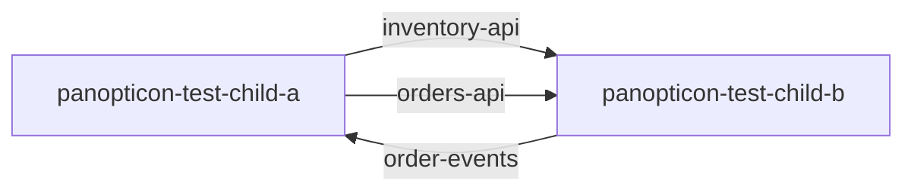
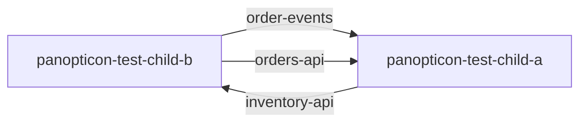

<<<<<<< HEAD
<!-- Generated by panopticon.diagrams from the compiled interface index. Do not edit by hand:
     rebuilt automatically on every merge to a child repo's default branch. -->
=======
# Architecture

<!-- Generated by panopticon.diagrams from the compiled interface and dependency indices.
     Do not edit by hand: rebuilt automatically on every merge to a child repo's
     default branch. -->
>>>>>>> template/main

## Organization architecture

<<<<<<< HEAD
## panopticon-test-child-a

See this repo's own diagram: [panopticon-test-child-a/architecture.md](panopticon-test-child-a/architecture.md)
=======
No cross-repo interface or dependency relationships yet — see [initializing a
child repo](setup-guide.md#4-initialize-a-child-repo).
>>>>>>> template/main

<<<<<<< HEAD

| Interface | Type | Direction | Other repo | Other repo's role |
| --- | --- | --- | --- | --- |
| `inventory-api` | rest | produces | [panopticon-test-child-b](panopticon-test-child-b/architecture.md) | consumer |
| `order-events` | kafka | consumes | [panopticon-test-child-b](panopticon-test-child-b/architecture.md) | owner/producer |
| `orders-api` | rest | produces/consumes | [panopticon-test-child-b](panopticon-test-child-b/architecture.md) | producer |

## panopticon-test-child-b

See this repo's own diagram: [panopticon-test-child-b/architecture.md](panopticon-test-child-b/architecture.md)

| Interface | Type | Direction | Other repo | Other repo's role |
| --- | --- | --- | --- | --- |
| `inventory-api` | rest | consumes | [panopticon-test-child-a](panopticon-test-child-a/architecture.md) | owner/producer |
| `order-events` | kafka | produces | [panopticon-test-child-a](panopticon-test-child-a/architecture.md) | consumer |
| `orders-api` | rest | produces | [panopticon-test-child-a](panopticon-test-child-a/architecture.md) | producer/consumer |
=======
>>>>>>> template/main
