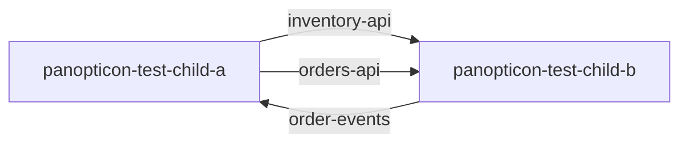
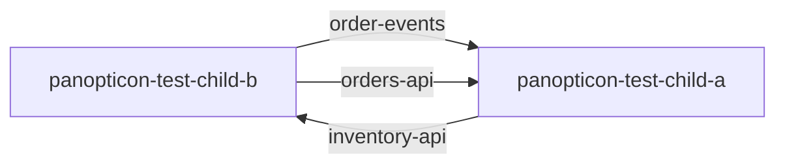

<!-- Generated by panopticon.diagrams from the compiled interface index. Do not edit by hand:
     rebuilt automatically on every merge to a child repo's default branch. -->

# Organization architecture

## panopticon-test-child-a

See this repo's own diagram: [docs/panopticon-test-child-a/architecture.md](docs/panopticon-test-child-a/architecture.md)

| Interface | Type | Direction | Other repo | Other repo's role |
| --- | --- | --- | --- | --- |
| `inventory-api` | rest | produces | [panopticon-test-child-b](docs/panopticon-test-child-b/architecture.md) | consumer |
| `order-events` | kafka | consumes | [panopticon-test-child-b](docs/panopticon-test-child-b/architecture.md) | owner/producer |
| `orders-api` | rest | produces/consumes | [panopticon-test-child-b](docs/panopticon-test-child-b/architecture.md) | producer |

## panopticon-test-child-b

See this repo's own diagram: [docs/panopticon-test-child-b/architecture.md](docs/panopticon-test-child-b/architecture.md)

| Interface | Type | Direction | Other repo | Other repo's role |
| --- | --- | --- | --- | --- |
| `inventory-api` | rest | consumes | [panopticon-test-child-a](docs/panopticon-test-child-a/architecture.md) | owner/producer |
| `order-events` | kafka | produces | [panopticon-test-child-a](docs/panopticon-test-child-a/architecture.md) | consumer |
| `orders-api` | rest | produces | [panopticon-test-child-a](docs/panopticon-test-child-a/architecture.md) | producer/consumer |
