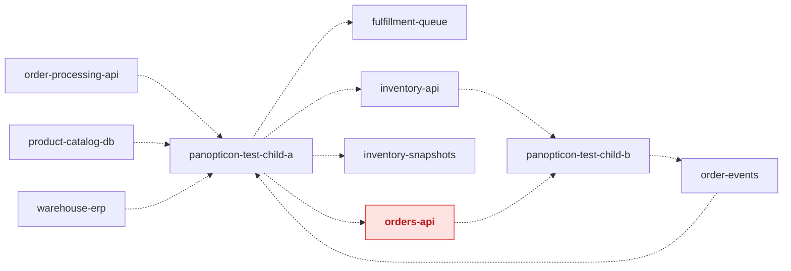
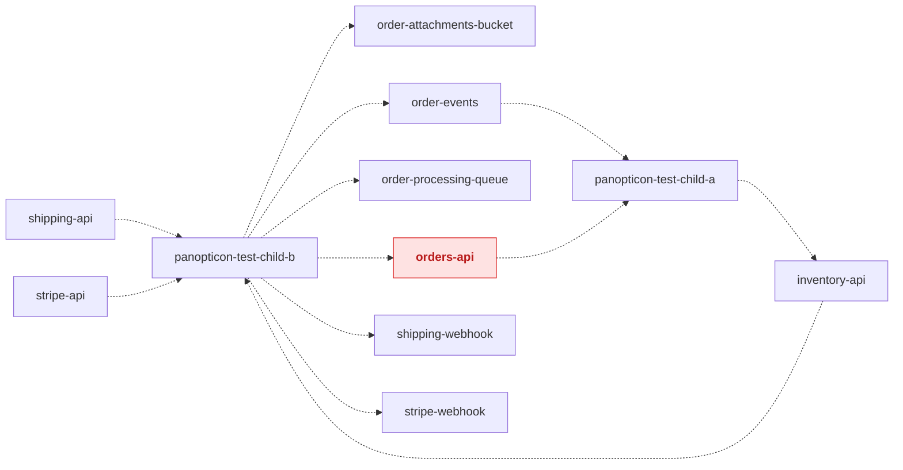

<!-- Generated by panopticon.diagrams from the compiled interface and dependency indices.
     Do not edit by hand: rebuilt automatically on every merge to a child repo's default branch. -->

# Organization architecture

## Detected interface conflicts

- **`orders-api` (rest)** — ownership-dispute: repos ['panopticon-test-child-a', 'panopticon-test-child-b'] each claim ownership of 'orders-api' (rest) (repositories: `panopticon-test-child-a`, `panopticon-test-child-b`)

## panopticon-test-child-a

See this repo's own diagram: [panopticon-test-child-a/architecture.md](panopticon-test-child-a/architecture.md)

| Kind | Name | Type/Ecosystem | Direction | Other repo | Other repo's role |
| --- | --- | --- | --- | --- | --- |
| interface | `fulfillment-queue` | sqs | produces/consumes | — | — |
| interface | `inventory-api` | rest | produces | [panopticon-test-child-b](panopticon-test-child-b/architecture.md) | consumer |
| interface | `inventory-snapshots` | s3 | produces/consumes | — | — |
| interface | `order-events` | kafka | consumes | [panopticon-test-child-b](panopticon-test-child-b/architecture.md) | owner/producer |
| interface | `order-processing-api` | rest | consumes | — | — |
| interface | 🔴 **`orders-api`** | rest | produces/consumes | [panopticon-test-child-b](panopticon-test-child-b/architecture.md) | producer |
| interface | `product-catalog-db` | postgres | consumes | — | — |
| interface | `warehouse-erp` | rest | consumes | — | — |

## panopticon-test-child-b

See this repo's own diagram: [panopticon-test-child-b/architecture.md](panopticon-test-child-b/architecture.md)

| Kind | Name | Type/Ecosystem | Direction | Other repo | Other repo's role |
| --- | --- | --- | --- | --- | --- |
| interface | `inventory-api` | rest | consumes | [panopticon-test-child-a](panopticon-test-child-a/architecture.md) | owner/producer |
| interface | `order-attachments-bucket` | s3 | produces/consumes | — | — |
| interface | `order-events` | kafka | produces | [panopticon-test-child-a](panopticon-test-child-a/architecture.md) | consumer |
| interface | `order-processing-queue` | sqs | produces/consumes | — | — |
| interface | 🔴 **`orders-api`** | rest | produces | [panopticon-test-child-a](panopticon-test-child-a/architecture.md) | producer/consumer |
| interface | `shipping-api` | rest | consumes | — | — |
| interface | `shipping-webhook` | webhook | produces | — | — |
| interface | `stripe-api` | rest | consumes | — | — |
| interface | `stripe-webhook` | webhook | produces | — | — |
