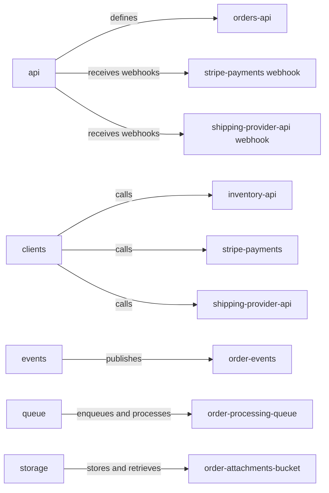

# panopticon-test-child-b — architecture overview

## Purpose

This repository contains TypeScript modules for an Orders REST API contract, order-lifecycle event publication, SQS-backed order-job processing, S3 attachment storage, and integrations with inventory, Stripe, and shipping services. `infra/` YAML files declare the SQS queue, S3 bucket, and consumed services that the modules use.

The checked-in code does not include an application bootstrap that mounts the route modules or coordinates these modules into an order-processing workflow. `package.json` references `src/index.ts`, which does not exist in the repository, so the OpenAPI specification and route handlers define the visible API contract only.

## Components

- [api](components/api.md) — defines the Orders REST contract, route handlers, and webhook receivers.
- [clients](components/clients.md) — calls inventory, Stripe, and shipping providers.
- [events](components/events.md) — declares and publishes order lifecycle events.
- [queue](components/queue.md) — declares the order-processing queue, enqueues jobs, and long-polls them.
- [storage](components/storage.md) — declares the attachments bucket and manages order attachments in it.

## Architecture diagram

[Panopticon analysis scope](operations.md#panopticon-analysis-scope)
[org diagram](https://github.com/industrial-curiosity/panopticon-test/blob/main/docs/architecture.md#panopticon-test-child-b)

## Data flow

The `api` component defines the `orders-api` REST contract in `src/api/openapi.yaml` and its route handlers in `src/api/routes/orders.ts`, and receives inbound webhooks through `src/api/routes/webhooks.ts` (the `stripe-payments` and `shipping-provider-api` webhook interfaces). There is no bootstrap that mounts these routes.

The `clients` component calls the `inventory-api`, `stripe-payments`, and `shipping-provider-api` REST services using base URLs from environment variables. The `events` component publishes order lifecycle events to the `order-events` Kafka topic via `publishOrderEvent`. The `queue` component sends order jobs to `order-processing-queue` with `enqueueOrder`; `src/queue/worker.ts` long-polls the queue with `receiveOrders`, processes jobs, and deletes handled messages. The `storage` component uploads, presigns, and deletes objects in `order-attachments-bucket`.

The source does not orchestrate these components into a single order-processing workflow; each module is self-contained.

## Dependencies

This repository consumes the `inventory-api`, `stripe-payments`, and `shipping-provider-api` REST services, the `order-processing-queue` SQS queue, the `order-attachments-bucket` S3 bucket, and the Kafka brokers backing `order-events`. `infra/services.yaml` declares the consumed services. If any of these systems is unavailable, the corresponding client call, event publication, queue operation, or attachment operation fails; see [interfaces.md](interfaces.md) for the indexed contracts.
