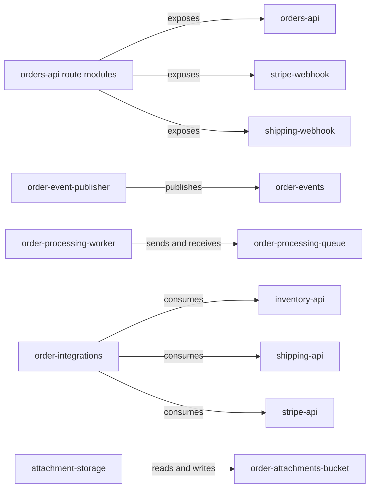

# panopticon-test-child-b — architecture overview

## Purpose

This repository contains TypeScript modules for order management. It defines an orders REST contract, inbound payment and shipping webhook routes, order-event publication, SQS order processing, S3 attachment operations, and clients for inventory, shipping, and Stripe systems.

The repository is a collection of modules rather than a complete application: the README and package scripts identify no committed application bootstrap that wires the HTTP routes and integrations together. The architecture below therefore describes the code-defined logical components and their declared interfaces, not a running deployment topology.

## Components

- [orders-api](components/orders-api.md) — defines order routes and payment/shipping webhook endpoints.
- [order-event-publisher](components/order-event-publisher.md) — publishes order events to Kafka.
- [order-processing-worker](components/order-processing-worker.md) — enqueues and processes order jobs through SQS.
- [order-integrations](components/order-integrations.md) — calls inventory, shipping, and Stripe APIs.
- [attachment-storage](components/attachment-storage.md) — stores and retrieves order attachments in S3.

## Architecture diagram

[Panopticon analysis scope](operations.md#panopticon-analysis-scope)
[panopticon-test-child-b org architecture](https://github.com/industrial-curiosity/panopticon-demo/blob/main/docs/architecture.md#panopticon-test-child-b)

## Data flow

The OpenAPI document and order route module define the `orders-api` contract. The webhook route module defines the `stripe-webhook` and `shipping-webhook` contracts. No committed bootstrap shows how these routers are mounted.

The integration modules call the consumed `inventory-api`, `shipping-api`, and `stripe-api` interfaces. The event publisher connects to the configured Kafka brokers and publishes `order-events`. The queue processor sends and receives messages through `order-processing-queue`, while the worker continuously processes received jobs. The attachment module reads and writes `order-attachments-bucket` and creates signed download URLs.

## Dependencies

The code consumes the external `inventory-api`, `shipping-api`, and `stripe-api` contracts, plus AWS SQS and S3 resources and the Kafka `order-events` topic. Runtime package dependencies include Express, KafkaJS, Stripe, and AWS SDK modules. The local dependency index contains no internal same-organization package dependencies.
